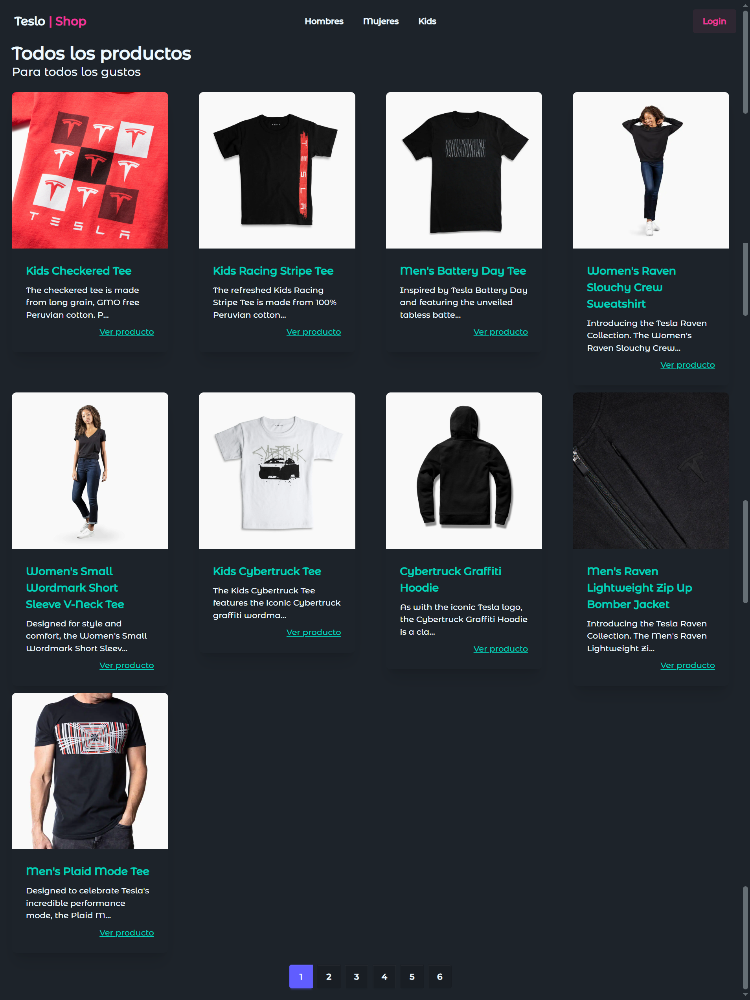
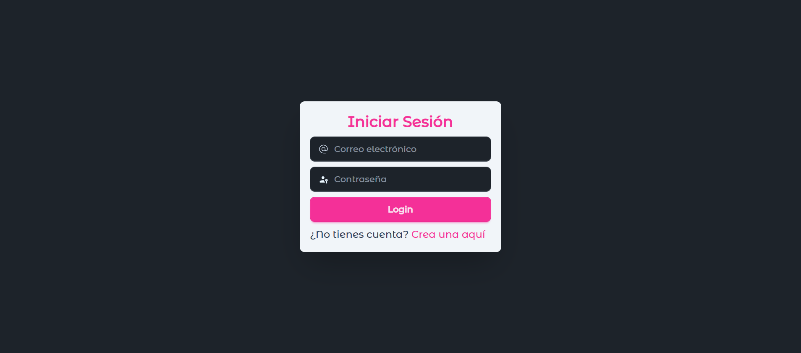
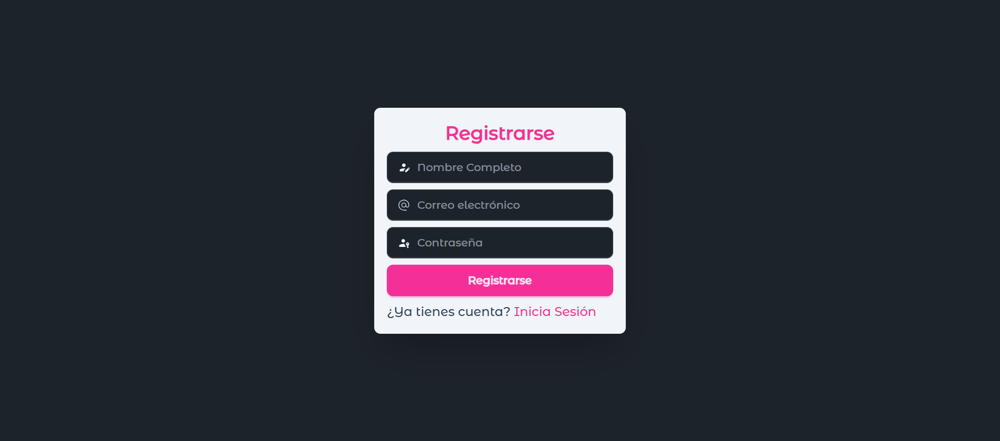
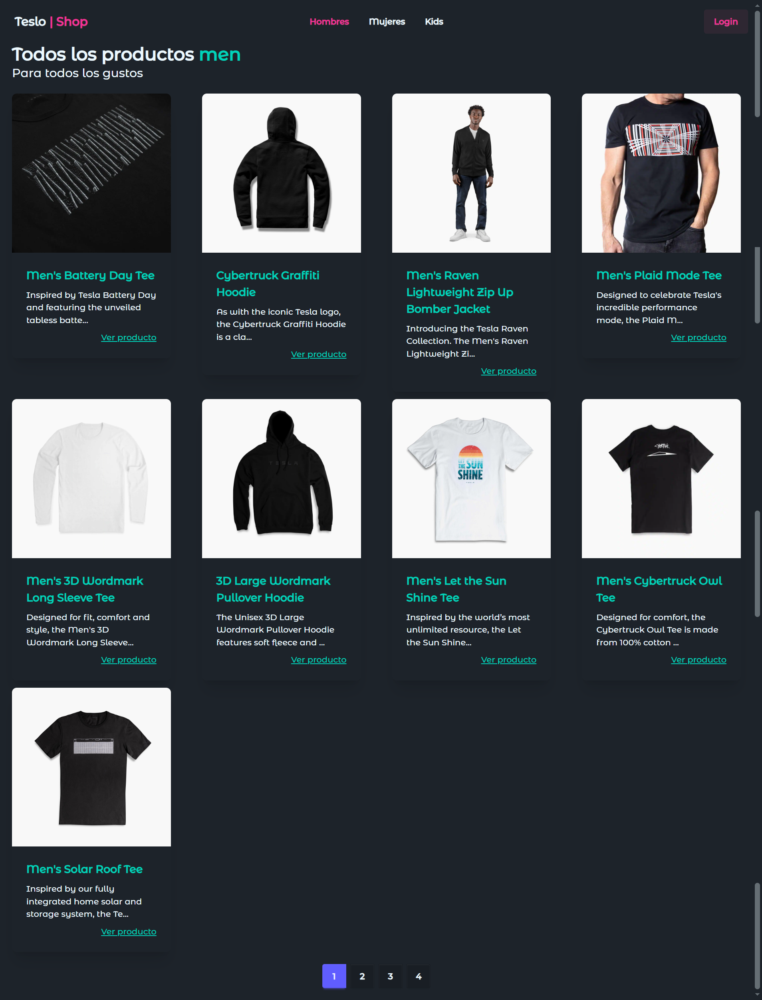
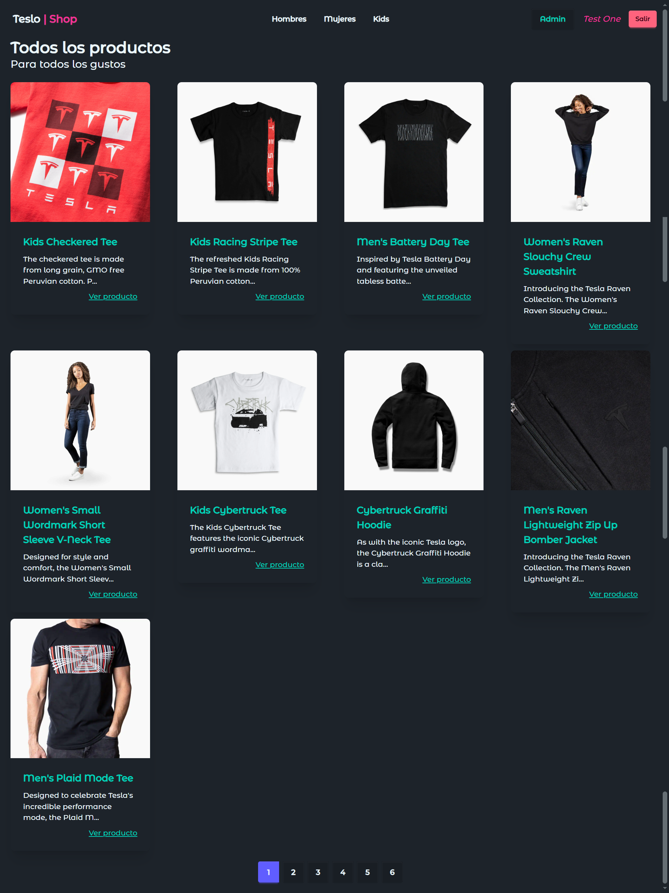
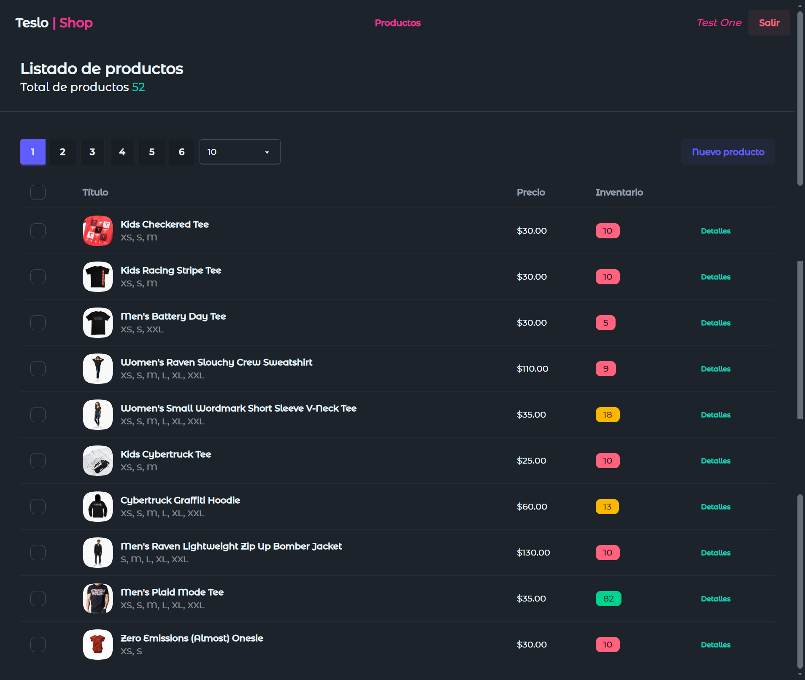
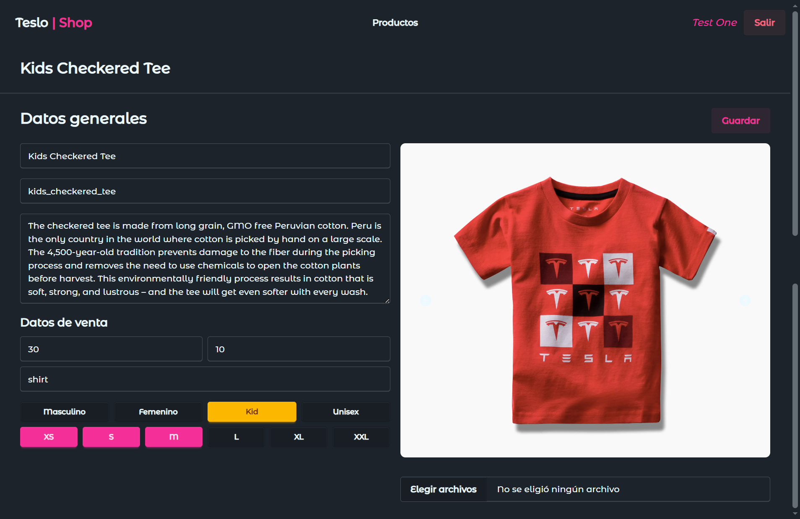
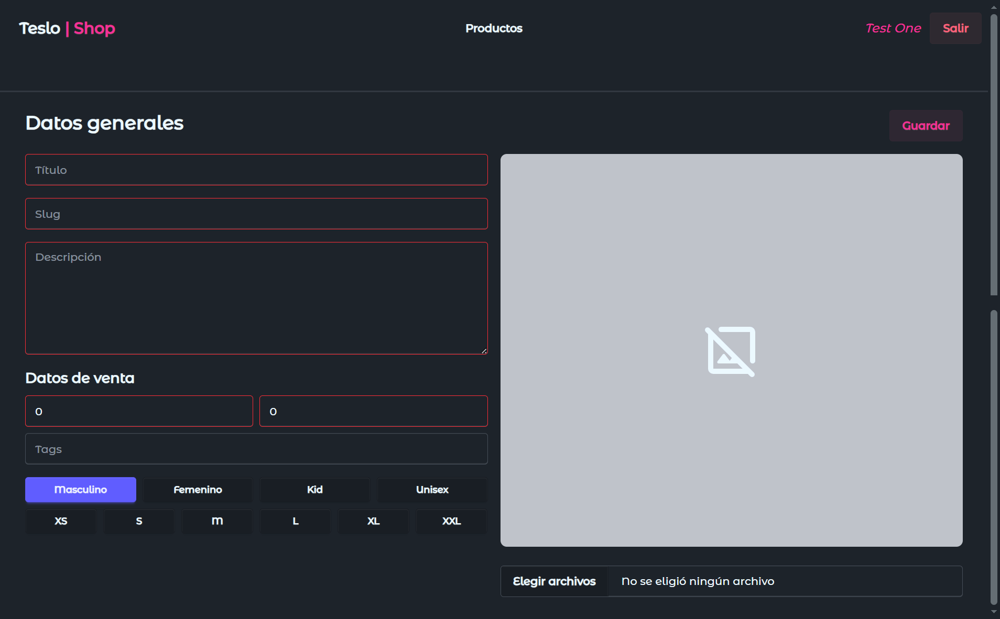

# TesloshopAngular

<p align="center">
  &nbsp;
  
</p>

**TesloshopAngular** aplicacion de ropa en donde podemos encontrar lista de producto para hombre, mujer y niño por lo cual usamos un backen propio hecho en **Nest**. Hecho con **Angular** y para los estilos **Tailwind CSS** y **daisyUI**.

## Run Locally

Clone the project

```bash
  git clone https://github.com/miguel-camara/tesloshop-angular.git
```

Go to the project directory

```bash
  cd tesloshop-angular
```

Install dependencies

```bash
  npm install
```

Generate the `environment.ts` based on the `environment.developments.ts`. Backend required

Run the script

```bash
  ng g environments
```

Start the server

```bash
  npm run start
```

## Environment Variables

To run this project, you will need to add the following environment variables to your **environment.ts** files

`baseUrl`

## Demo

[Demo](https://teslo-shop-app-miguel.netlify.app/#/)

## Screenshots

















## Features

- **Tesloshop Angular:** Aplicación de ropa, con diferentes secciones de productos para hombre, mujer y niño.
- **Login:** Sección para iniciar sesión con un usuario ya registrado.
- **Register:** Sección para registrarse.
- **Admin:** Este es super usuario el cual tiene un panel propio en donde se listan todos los productos y puedo editarlos así como también crear nuevos productos.

## Tech Stack

**Frontend:** Angular, Tailwind CSS y daisyUI
